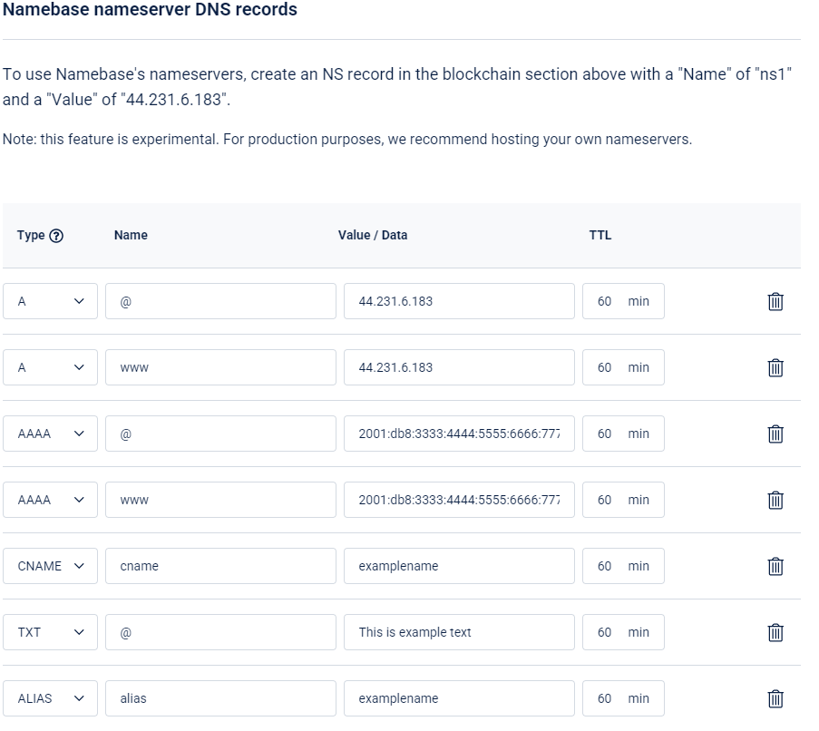
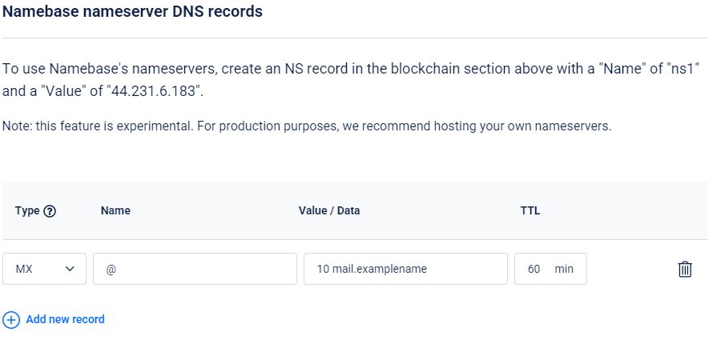

# DNS Records on Handshake names

Handshake names use the same DNS format as ICANN domains. The only difference is the TLD Nameserver records are included in the blockchain.
There are two type of DNS records.

## On Chain Records
### NS Records
These are used to identify the Server that provides the Off chain DNS records.
You can check these records using a block explorer. To check the records for this example visit [https://niami.io/domain/examplename](https://niami.io/domain/examplename)

The format for these records is
| Resource | Value |
| ---- | ---- |
| type | `NS` |
| ns | `<NS>` |

For example
| Resource | Value |
| ---- | ---- |
| type | `NS` |
| ns | `ns.examplename.` |

### GLUE4 & GLUE6 Records
These records are used to bind IPv4 and IPv6 addresses to Handshake domains. This is used in conjunction with NS records to point to a IP for the Nameserver.

The format for these records is
| Resource | Value |
| ---- | ---- |
| type | `GLUE4` |
| ns | `<NS>` |
| address | `<IPv4>` |

For example
| Resource | Value |
| ---- | ---- |
| type | `GLUE4` |
| ns | `ns.examplename.` |
| address | `45.79.95.228` |

### DS Records
These records are used for DNSSEC and allows the Nameserver to provide proof that it has the authority to provide DNS records.

The format for these records is
| Resource | Value |
| ---- | ---- |
| type | `DS` |
| keyTag | `<KEYTAG>` |
| algorithm | `<ALGORITHM>` |
| digestType | `<DIGESTTYPE>` |
| digest | `<DIGESTVALUE>` |

For example
| Resource | Value |
| ---- | ---- |
| type | `DS` |
| keyTag | `7789` |
| algorithm | `8` |
| digestType | `2` |
| digest | `50e0f5c246f85d8d09f8f0c5be4ab3788c3b1cf97f04f47aee3c6343ad758ccd` |

### TXT Records
These are used for storing arbitrary data. In some cases it is used to prove ownership of a domain.

The format for these records is
| Resource | Value |
| ---- | ---- |
| type | `TXT` |
| text | `<TEXT record>` |

For example
| Resource | Value |
| ---- | ---- |
| type | `TXT` |
| text | `This is an example TXT record` |

## Off-Chain Records

These records are the same as ICANN domains. They are provided by the nameserver specified in the NS records on the chain.
These records include (but not limited to): A, AAAA, CNAME, DS, MX, NS, TLSA, TXT.

# Adding DNS records to domains in Namebase

## On-Chain Records
### GLUE4

To add a Nameserver using an IP address you need to use a GLUE4 record.
For example, to add a nameserver record for GLUE4 with IP address `44.231.6.183` (this is the default Namebase nameserver) you would add the first line as below:

### NS without GLUE4

To add a NS record to an existing domain's GLUE4 (or to point to an ICANN domain's A record) you need to add the nameserver in the `Value` field while leaving the `Name` field blank. This is shown in the below image.

### DS Records

Adding a DS record to names in Namebase is very easy. Simply add the DS content in the `Value` field. This is shown in the image below.

### TXT Records

Adding TXT records is as easy as typing the contents of the record. This is shown in the image below.

## Off-Chain Records
### Common Records

Adding A, AAAA, CNAME, and ALIAS records to the TLD is quite easy. The below image shows the format in case you get stuck.

### MX Records

MX records are a little bit more complicated. You need to supply the priority in the `Value` field as well as the `Name` of the email server. This is shown in the image below ("10" is the priority for "mail.examplename").

